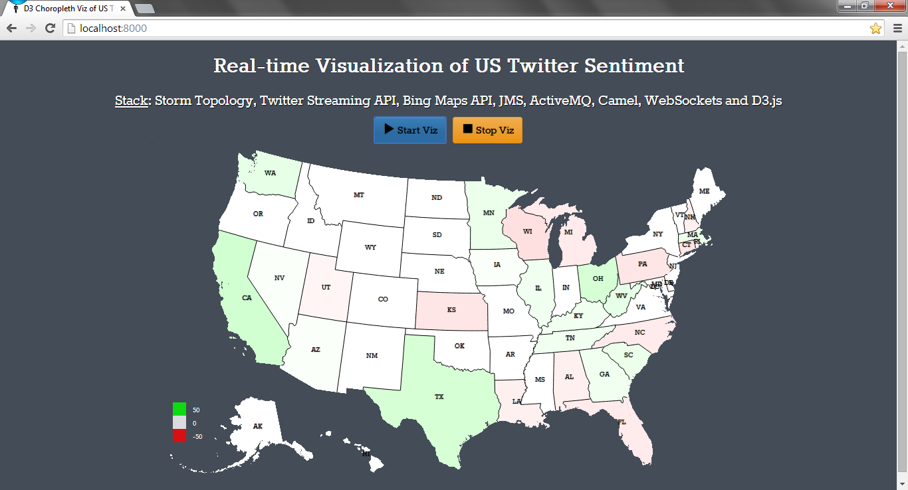
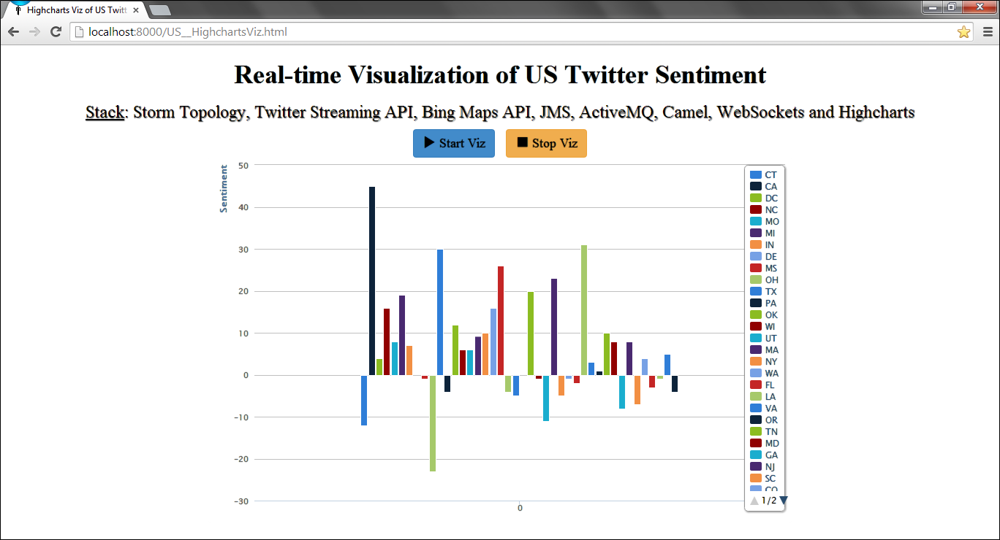

# StormTweetsSentimentD3Viz
----------

### You might also be interested in checking out my other project, an extension of this repo for Twitter sentiment of counties / regions of UK using D3.js Choropleth Map on [StormTweetsSentimentD3UKViz](https://github.com/P7h/StormTweetsSentimentD3UKViz).

## Introduction
This repository contains an application which is built to demonstrate as an example of Apache Storm distributed framework by performing sentiment analysis of tweets originating from U.S. in real-time. This Topology retrieves tweets originating from US and computes and visualizes the sentiment scores of each of the state of United States [based on tweets] in a Choropleth Map using [D3.js](http://d3js.org) continuously for 10 minutes [in local mode]. User can also explicitly kill the topology by pressing `Ctrl+C` for exiting the application. Also, there is a column chart visualization of each State and its sentiment value using [Highcharts](http://www.highcharts.com).

[Apache Storm](http://storm.apache.org) is an open source distributed real-time computation system, developed at BackType by Nathan Marz and team. It has been open sourced by Twitter [post BackType acquisition] in August, 2011. And Storm became a [top level project in Apache](https://blogs.apache.org/foundation/entry/the_apache_software_foundation_announces64) on 29th September, 2014. 
This application has been developed and tested with Storm v0.8.2 on Windows 7 in local mode; and was eventually updated and tested with Storm v0.9.3 on 05th January, 2014. Application may or may not work with earlier or later versions than Storm v0.9.3. 

This application has been tested in: 

+ Local mode on a CentOS virtual machine and even on Microsoft Windows 7 machine.
+ Cluster mode on a private cluster and also on Amazon EC2 environment of 4 machines and 5 machines respectively; with all the machines in private cluster running Ubuntu while EC2 environment machines were powered by CentOS.
	+ Recent update to Apache Storm v0.9.3 has not been tested in a Cluster mode.

## Features
* Application retrieves tweets using Twitter Streaming API (using [Twitter4J](http://twitter4j.org)). 
* It analyses sentiments of all the tweets originating from US.
* There are three different objects within a tweet that we can use to determine it’s origin. This application tries to find the location using all the three options and prioritizes location received in the following order [high to low]:
	* The coordinates object.
	* The place object.
	* The user object.
* For reverse geocoding, this application uses Bing Maps API. 
	* For more information and sign up, please check [Getting Started with Bing Maps](http://msdn.microsoft.com/en-us/library/ff428643.aspx).
	* Please note that you would need Windows Live account for signing up for [Bing Maps API key](https://www.bingmapsportal.com/).
	* Also, please consider opting for Basic Plan for Bing Maps API, as that is better for our usage. As of 18th June, 2013, limit is 50k requests for 24 hours in Basic Plan.
	* I chose Bing Maps and not Google Maps since Google Maps is too restrictive for our usage, as it has a limit of only 2500 requests per day.
* This application uses [AFINN](http://www2.imm.dtu.dk/pubdb/views/publication_details.php?id=6010) which contains a list of pre-computed sentiment scores.
	* These words are used to determine sentiment of the each tweet which is retrieved using Streaming API.
* By understanding sentiment values, we can get the most happiest state of US and most unhappiest state as well.
* For visualization, I am using D3 to display the sentiment value of each state in real-time by conveying it in a color, appropriate to the sentiment value. Color of the State moves from red to green, as its corresponding sentiment value improves. 
* There is another visualization context using Highcharts, which is a column chart of each State and its corresponding sentiment value. This chart also updates in real-time based on the sentiment value of each of the state.
* This codebase has been updated with decent comments, wherever required.
* Also this project has been made compatible with both Eclipse IDE and IntelliJ IDEA. Import the project in your favorite IDE [which has Maven plugin installed] and you can quickly follow the code.

## Demo
### D3 Choropleth Visualization
#### GIF of D3 Choropleth Visualization

#### Screenshot of D3 Choropleth Visualization

### Highcharts Visualization
#### GIF of Highcharts Visualization

#### Screenshot of Highcharts Visualization

## Configuration
* Please check the [`config.properties`](src/main/resources/config.properties#L3-6) and add your own values and complete the integration of Twitter API to your application by looking at your values from [Twitter Developer Page](https://dev.twitter.com/apps). 
	* If you did not create a Twitter App before, then please create a new Twitter App where you will get all the required values of `config.properties` afresh and then populate them here without any mistake. 
* Also please add the value of Bing Maps API Key to [`config.properties`](src/main/resources/config.properties#L10), as that will be used for getting the reverse geocode location using Latitude and Longitude. 
	* If you do not have Bing Maps API Key, please check [Getting Started with Bing Maps](http://msdn.microsoft.com/en-us/library/ff428643.aspx) for signup and other information. 
* And finally please check [but _do not modify_] the [`AFINN-111.txt`](src/main/resources/AFINN-111.txt) file to see the pre-computed sentiment scores of ~2500 words / phrases.
	* For more info on AFINN, please check its [`AFINN-README.txt`](src/main/resources/AFINN-README.txt) and also check his [paper](http://www2.imm.dtu.dk/pubdb/views/publication_details.php?id=6010).

## Dependencies
* Storm v0.9.3
* Jackson v1.9.13
* Spring v4.0.3
* Camel v2.13.0
* ActiveMQ Camel v5.9.0
* Twitter4J v4.0.2
* Google Guava v18.0
* Logback v1.1.2

Also, please check [`pom.xml`](pom.xml) for more information on the various other dependencies of the project. 

## Requirements
This project uses Maven to build and run the topology. 
You need the following on your machine:

* Oracle JDK >= 1.8.x
* Apache Maven >= 3.2.3
* Python v2.7.x installed on the machine for triggering the visualization server-side hosting.
* Clone this repo and import as an existing Maven project to either Eclipse IDE or IntelliJ IDEA.
* This application uses [Google Guava](https://code.google.com/p/guava-libraries) for making life simple while using Collections and other generic stuff.
* This application also uses [Jackson](http://jackson.codehaus.org) for unmarshalling the JSON response got from Bing Maps API.
* Requires ZooKeeper, etc installed and configured in case of executing this project in distributed mode i.e. Storm Cluster. 
	- Follow the steps on [Storm Wiki](http://storm.apache.org/documentation/Setting-up-a-Storm-cluster.html) for more details on setting up a Storm Cluster. 

Rest of the required frameworks and libraries are downloaded by Maven as required in the build process, the first time the Maven build is invoked.

## Usage
To build and run this topology, you must use Java 1.8.

### Local Mode:
* All the required frameworks and libraries are downloaded by Maven as required. 
* Local mode can also be run on Windows environment without installing any specific software or framework as such. 
*Note*: Please be sure to clear your temp folder as it adds lot of temporary files in every run. 
* In local mode, this application can be run from command line by invoking:

Either

    mvn clean compile exec:java -Dexec.classpathScope=compile -Dexec.mainClass=org.p7h.storm.sentimentanalysis.topology.SentimentAnalysisTopolog

or

    mvn clean compile package && java -jar target/storm-sentiment-viz-0.1-jar-with-dependencies.jar

* Start Python SimpleHTTPServer in the [`web`](web) folder of this code repo. 

Command:

    python -m SimpleHTTPServer

* For D3 Choropleth Map visualization, launch a browser [preferably Google Chrome] and point to [`index.html`](http://localhost:8000) hosted on the above Python server. 
	* Click on "Start Viz" button to trigger the D3 Choropleth Map visualization. 
	* You can stop the visualization any time by clicking on "Stop Viz" button. 
	* This Map updates as and when a tweet is analyzed by Storm and displays in real-time, visualization of the sentiment value of each of the State of United States of America. 
* For Highcharts visualization, launch a browser [preferably Google Chrome] and point to [`US__HighchartsViz.html`](http://localhost:8000/US__HighchartsViz.html) 
	* Click on "Start Viz" button to trigger the Highcharts visualization. 
	* You can stop the visualization as well by clicking on "Stop Viz" button. 
	* This chart updates every second and displays in real-time, visualization of the sentiment value of each of the State of United States of America. 

### Distributed [or Cluster / Production] Mode:
Distributed mode requires a complete and proper Storm Cluster setup. Please check [wiki on Apache Storm website](http://storm.apache.org/documentation/Setting-up-a-Storm-cluster.html) for setting up a Storm Cluster. 
In distributed mode, after starting Nimbus and Supervisors on individual machines, this application can be executed on the master [or Nimbus] machine by invoking the following on the command line:

Command:

    storm jar target/storm-sentiment-viz-0.1.jar org.p7h.storm.sentimentanalysis.topology.SentimentAnalysisTopology SentimentAnalysis

## Problems
If you find any issues, please report them either raising an [issue](https://github.com/P7h/StormTweetsSentimentD3Viz/issues) here on GitHub or alert me on my Twitter handle [@P7h](http://twitter.com/P7h). Or even better, please send a [pull request](https://github.com/P7h/StormTweetsSentimentD3Viz/pulls).
Appreciate your help. Thanks!

## License
Copyright &copy; 2013-2015 Prashanth Babu. 
Licensed under the [Apache License, Version 2.0](http://www.apache.org/licenses/LICENSE-2.0).